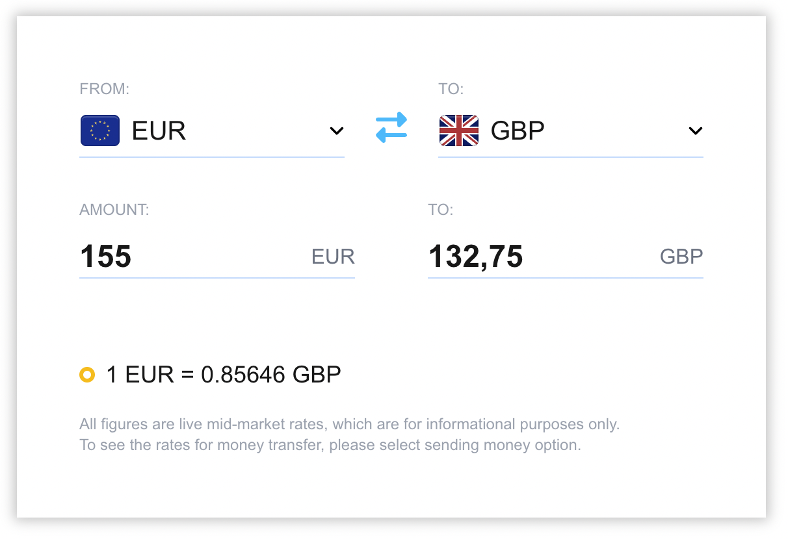

# Currency Converter

 This is currency converter made using TransferGo `https://my.transfergo.com/api/fx-rates` api

## Local development

First, install the dependencies:

```bash
npm run install
```

Then, run the development server:

```bash
npm run dev
```

Open [http://localhost:3000](http://localhost:3000) with your browser to see the result.

## Deployment preview

You can check main branch deployment [currency-converter-pink-theta.vercel.app](https://currency-converter-pink-theta.vercel.app/), each commit push to `main` is deployed.

## Screenshots


